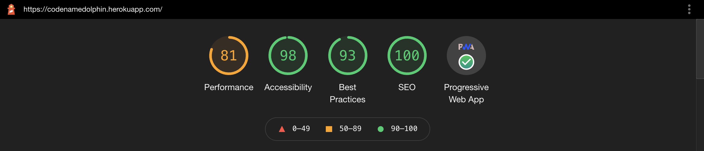

# Codename Dolphin 

Check out the ✨[Heroku Deployment](https://codenamedolphin.herokuapp.com/)✨

---

## Overview

Codename Dolphin is a fully modular synthesizer that exists in an interactive 3D environment! This project was designed to allow users with no prior music experience the ability to explore sound design and music creation in a fun + accessible way.

#### Contributors

[Chris Anderson](https://github.com/mistercanderson "Chris's GitHub")

[Tyson McNutt](https://github.com/tysnj "Tyson's GitHub")

[Pat Findley](https://github.com/Patfindley "Pat's GitHub")

#### Tech Stack:

- [React](https://reactjs.org/) + [React Router](https://reactrouter.com/)
- [Tone.js](https://tonejs.github.io/)
- [Three.js](https://threejs.org/)
- [GSAP](https://greensock.com/gsap/)
- [Cypress](https://www.cypress.io/)
- CI/CD with [CircleCI](circleci.com) + [Heroku](heroku.com)
- [Workbox](https://developers.google.com/web/tools/workbox) + [PWA](https://developer.mozilla.org/en-US/docs/Web/Progressive_web_apps) Optimization

  

## Installation

#### For Business:

1. Clone down this repo with `git clone`
2. Run `npm i` to install dependencies
3. Run `npm start` to open the app

#### For Pleasure:

1. Visit the [deployed app](https://codenamedolphin.herokuapp.com/) in a Chrome browser
2. Open the Chrome controls menu (three dots in the top right) and select "Install Codename Dolphin" (desktop) or "Add to Home Screen" (mobile).

## How to Play

- Make sure the sound is on! (also, rotate your phone horizontally if you're using one)
- Play notes by clicking/touching the keys, or try using your computer keyboard to play
- Morph the sound by playing with the effects sliders (if you have a scroll wheel, this can be used to change the sliders)
  - *Angeryness*: distortion + grit
  - *Bendyness*: pitch bend
  - *Sharpyness*: low pass filter cutoff + resonance shift
  - *Volumeyness*: control the output level 
- Double clicking the "Bendyness" slider will reset it to neutral
- Three oscillator types (Square, AM sine, and FM triangle) can be used to change the overall timbre of the synth
- Look around the 3D space by clicking & dragging the area behind the keyboard (holding shift will change your position)
- **Pro Tip**: play notes with one hand using the computer keyboard, while the other hand is used to control the effect sliders with a mouse + scroll wheel

## What's Next?

- Mozart Mode (play complex chords with one finger/click)
- Arpeggiator
- Saving user presets
- MIDI integration
